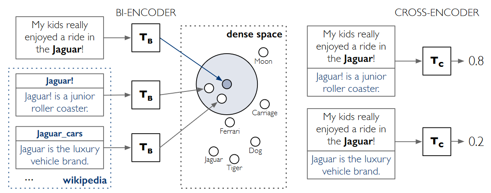
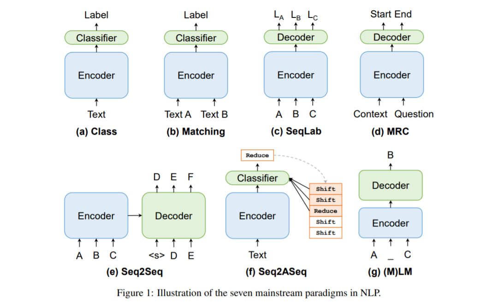

# A Link to the Past and Future: Trends of Entity Linking
This repository aims to give an comprehensive view about Entity Linking, and track the recent trends of EL research.

## Recent Trends of Entity Linking
Please refer to [izuna385's repository](https://github.com/izuna385/Entity-Linking-Recent-Trends) for papers before NAACL'21 and ICLR'21.

### ACL'22
* [Improving Candidate Retrieval with Entity Profile Generation for Wikidata Entity Linking](https://arxiv.org/abs/2202.13404)
    - Wikidata is the most extensive crowdsourced KB, but its massive number of entities also makes EL challenging. To effectively narrow down the search space, we propose a novel candidate retrieval paradigm based on entity profiling rather than using the traditional alias table.
    - Entity profiling means to generate the profile (description and attributes) of an entity given its context. The model adopts the encoder-decoder pretrained language model BART to generate the profile.
    - The model then uses a Gradient Boosted Tree (GBT) model to combine the candidate entities retrieved by ElasticSearch via alias table and entity profile. A cross-attention reranker is then adopted to rank the candidate entities and find the correct entity.

### ICLR'22
* [ENTQA: ENTITY LINKING AS QUESTION ANSWERING (ICLR'22 Spotlight)](https://arxiv.org/abs/2110.02369)
    - The traditional entity linking paradigm can be viewed as a two-stage pipeline: first finding the mention spans in text (i.e. Named Entity Recognition, NER), followed by disambiguating their corresponding entity in the knowledge base (which is the focus of most EL works). The NER step requires finding mentions without knowing their entities, which is unnatural and difficult.
    - **EntQA** views entity linking as a reversed open-domain question answering problem, finding related entities before performing NER stage. The model first retrieves entities related to the full text with a bi-encoder architecture, then predicts the mention span of each candidate entity. Spans with probability lower than `(1,1)` will be discarded. 
    - **EntQA** reverses the order of two stages, thus sheding new light on the EL field. Entity linking is viewed as a sequence matching problem, but this paper proves the MRC paradigm to be applicable. What about other paradigms, e.g. seq2seq(GENRE), sequence labeling, masked language prediction, etc...?

### EMNLP'21
* [Highly Parallel Autoregressive Entity Linking with Discriminative Correction](https://arxiv.org/abs/2109.03792)
    - Encodes the text with Longformer, then predicts the mention spans with FNN, and generates corresponding entity with a simple LSTM. A correction step with MLP is followed afterwards to ensure the chosen entity has the highest probablity.
    - Simple structure after the encoder, enabling parallel linking. Also a combination of autoregressive EL and multi-choice EL.

* [Low-Rank Subspaces for Unsupervised Entity Linking](https://arxiv.org/abs/2104.08737)
    - Decomposites the embedding of context(by Word2Vec) and embedding(by DeepWalk) into low-dimension vectors, then combines similarity ranking-based weights to score the candidates.
    - Rare work about unsupervised entity linking(without annotated mention-entity pairs)

### ACL'21
* [MOLEMAN: Mention-Only Linking of Entities with a Mention Annotation Network](https://arxiv.org/abs/2106.07352)
    - The model seeks the most similar mentions rather than entities, viewing each mention in the training set as an "psuedo entity" reflecting a certain aspect of the corresponding entity.
    - A tradeoff between scale(more psuedo entities) and accuracy.

* [LNN-EL: A Neuro-Symbolic Approach to Short-text Entity Linking](https://arxiv.org/abs/2106.09795)
    - Uses logical neural network(LNN) to build interpretable rules based on first-order logic. The model is somewhat similar to tree-like neural networks, combining various features to form the final score.

## The Trend of Entity Linking

Given text $d$, Entity Linking aims to detect the mentions $M = (m_1, m_2, ..., m_n)$ (text spans that may refer to entities) and relate them to their corresponding entities $E = (e_1, e_2, ..., e_n)$ in target knowledge base $KB$.
The mention detection step is frequently studied as an independent problem NER(Named Entity Recogition), and most EL researches focus on the second step.

### Traditional Entity Linking: Representaion Learning
* The widely accepted approach in EL is to embed the mention context and candidate entities into the same vector space, and use the similarity between vectors(cosine, inner product, euclidan, etc) as ranking scores.
* Traditional EL models tend to use KGE(knowledge graph embedding) techniques to model the entities. Popular KGE models include TransE, RESCAL, ConvE, TuckER, etc.
* Structured information also frequently apperar in traditional EL models, like [inter-entity similarity](https://aclanthology.org/D17-1284/), [entity type](https://ojs.aaai.org/index.php/AAAI/article/view/6380), [entity relations](https://arxiv.org/abs/1811.08603).

### PLM-based Entity Linking: Dual Encoder and Dense Retrieval
* Traditional EL models need to train the entity embedding model on the whole KB, and is unfriendly to new entities and long-tail entities. PLM-based EL models encode the textual descriptions via PLMs to get entity embeddings, and suits large-scale KBs (Wikipedia, Wikidata) better.
* The popular structures in PLM-based EL models are bi-encoder and cross-encoder.

* The paper timeline about PLM-based Entity Linking: [Gillick et al.@CoNLL'19](https://arxiv.org/abs/1909.10506), [Agarwal et al.@Arxiv'20](https://arxiv.org/abs/2004.03555), [BLINK](https://arxiv.org/abs/1911.03814), [Gillick et al.@EMNLP'20](https://arxiv.org/abs/2011.02690), [MOLEMAN](https://arxiv.org/abs/2106.07352)

### The Future of Entity Linking: Paradigm Shift
* EL is commonly viewed as a matching problem: most EL models compute the similarity between mention context and candidate entities, selecting the entity with highest similarity score as the answer.
* However EL can also be tackled in other paradigms. For example, Seq2Seq([GENRE](https://arxiv.org/abs/2010.00904), [mGENRE](https://arxiv.org/abs/2103.12528), [Heng Ji et al.@ACL 2022 (Findings)](https://arxiv.org/abs/2202.13404)), MRC([EntQA](https://arxiv.org/abs/2110.02369)).
* What about other paradigms? Can they be applied on the EL problem?

